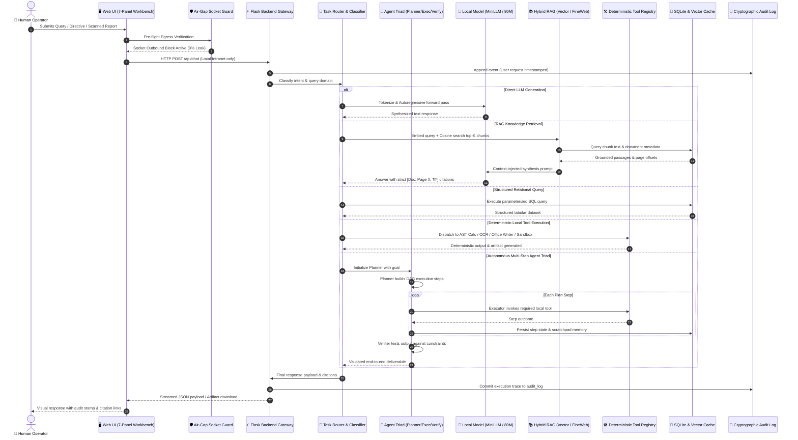

# Sovereign AI Workbench

<div align="center">

### A Local, From-Scratch LLM + RAG + SQL + Agentic AI Workbench for Sovereign and Offline AI

[](https://www.python.org/)
[](https://pytorch.org/)
[](docs/ARCHITECTURE.md)
[](docs/OFFLINE_PROOF.md)
[](docs/HONESTY_LEDGER.md)
[](docs/JUDGE_PRESENTATION_GUIDE.md)
[](LICENSE)

**Author:** Akash Upadhyay (B.Tech Computer Science / AI-ML)  
**Target Environment:** Air-Gapped Defense Units, Refineries, PSUs, Enterprise Workstations

</div>

---

> [!IMPORTANT]
> **Sovereignty & Architectural Transparency (Honesty First):**
> Sovereign AI Workbench is a locally controlled AI system that demonstrates how a language model can be trained **completely from scratch** (random initialization, custom tokenizer, custom Transformer architecture) and integrated with retrieval-augmented generation (RAG), structured SQL databases, deterministic local tools, autonomous agents, and cryptographic security controls—**without relying on an external cloud LLM API or Ollama for model inference**.
> 
> *The language model herein is a genuine, from-scratch, randomly-initialized, self-trained educational/research LLM (~10M parameters)—not an API wrapper and not a pretrained foundation download. Complete architectural and training transparency is documented in [`docs/ARCHITECTURE.md`](docs/ARCHITECTURE.md), [`docs/LLM_FROM_SCRATCH.md`](docs/LLM_FROM_SCRATCH.md), and [`docs/FINAL_AUDIT.md`](docs/FINAL_AUDIT.md).*

---

## Table of Contents

- [1. Project Overview](#1-project-overview)
- [2. Problem Statement](#2-problem-statement)
- [3. Proposed Solution](#3-proposed-solution)
- [4. Project Objectives](#4-project-objectives)
- [5. What Has Actually Been Built](#5-what-has-actually-been-built)
- [6. System Map & High-Level Architecture](#6-system-map--high-level-architecture)
- [7. How the LLM Was Made](#7-how-the-llm-was-made)
- [8. Model Architecture](#8-model-architecture)
- [9. Transformer Data Flow](#9-transformer-data-flow)
- [10. Causal Language Modeling](#10-causal-language-modeling)
- [11. From-Scratch Random Initialization](#11-from-scratch-random-initialization)
- [12. Training Dataset (Open-Orca)](#12-training-dataset-open-orca)
- [13. Why Open-Orca Is Used](#13-why-open-orca-is-used)
- [14. Dataset Lifecycle Pipeline](#14-dataset-lifecycle-pipeline)
- [15. Dataset-Driven Engineering vs. Manual Sentence Writing](#15-dataset-driven-engineering-vs-manual-sentence-writing)
- [16. Custom Tokenizer](#16-custom-tokenizer)
- [17. Why the Tokenizer Matters](#17-why-the-tokenizer-matters)
- [18. Training Infrastructure Pipeline](#18-training-infrastructure-pipeline)
- [19. Training Process & Optimization](#19-training-process--optimization)
- [20. Experiments: Primary ~10M vs. Experimental ~13M](#20-experiments-primary-10m-vs-experimental-13m)
- [21. Checkpointing Mechanics](#21-checkpointing-mechanics)
- [22. Local Inference](#22-local-inference)
- [23. Zero External LLM APIs](#23-zero-external-llm-apis)
- [24. No Ollama Dependency for Core Model Execution](#24-no-ollama-dependency-for-core-model-execution)
- [25. Why RAG Is Essential](#25-why-rag-is-essential)
- [26. Retrieval-Augmented Generation Architecture](#26-retrieval-augmented-generation-architecture)
- [27. RAG Subsystem Modules](#27-rag-subsystem-modules)
- [28. RAG Document Ingestion Lifecycle](#28-rag-document-ingestion-lifecycle)
- [29. Semantic Document Chunking](#29-semantic-document-chunking)
- [30. Vector Embeddings](#30-vector-embeddings)
- [31. Similarity Retrieval with Citations](#31-similarity-retrieval-with-citations)
- [32. Context Injection & Prompt Construction](#32-context-injection--prompt-construction)
- [33. RAG Does Not Retrain the Model](#33-rag-does-not-retrain-the-model)
- [34. SQL Database Persistence](#34-sql-database-persistence)
- [35. Why SQL Is Included](#35-why-sql-is-included)
- [36. Unified SQL + RAG Operation](#36-unified-sql--rag-operation)
- [37. SQL vs. Vector Search](#37-sql-vs-vector-search)
- [38. Task Router & Classifier](#38-task-router--classifier)
- [39. Agent Architecture: Planner, Executor & Verifier](#39-agent-architecture-planner-executor--verifier)
- [40. The Planner](#40-the-planner)
- [41. The Executor](#41-the-executor)
- [42. The Verifier](#42-the-verifier)
- [43. Memory and State Management](#43-memory-and-state-management)
- [44. Deterministic Local Tool System](#44-deterministic-local-tool-system)
- [45. Why Deterministic Tools Are Necessary](#45-why-deterministic-tools-are-necessary)
- [46. Centralized Tool Registry](#46-centralized-tool-registry)
- [47. Security Architecture](#47-security-architecture)
- [48. Role-Based Permissions](#48-role-based-permissions)
- [49. Audit Logging & Provenance](#49-audit-logging--provenance)
- [50. Air-Gapped Offline Mode](#50-air-gapped-offline-mode)
- [51. Socket-Level Network Monitoring](#51-socket-level-network-monitoring)
- [52. Automated Offline Verification](#52-automated-offline-verification)
- [53. Complete End-to-End Walkthrough Example](#53-complete-end-to-end-walkthrough-example)
- [54. Complete Repository File Structure](#54-complete-repository-file-structure)
- [55. Repository Responsibility Matrix](#55-repository-responsibility-matrix)
- [56. System-Wide Data Flow](#56-system-wide-data-flow)
- [57. Dynamic Knowledge Flow](#57-dynamic-knowledge-flow)
- [58. Installation & Setup Guide](#58-installation--setup-guide)
- [59. Hardware Verification](#59-hardware-verification)
- [60. Dataset Preparation](#60-dataset-preparation)
- [61. Tokenizer Training](#61-tokenizer-training)
- [62. Training the Custom LLM](#62-training-the-custom-llm)
- [63. Running Local Inference](#63-running-local-inference)
- [64. Executing Demonstration Scenarios](#64-executing-demonstration-scenarios)
- [65. Verifying Offline Air-Gap Operation](#65-verifying-offline-air-gap-operation)
- [66. Multi-Tier Testing Strategy](#66-multi-tier-testing-strategy)
- [67. Quantitative Evaluation Framework](#67-quantitative-evaluation-framework)
- [68. Evaluation Results & Benchmarks](#68-evaluation-results--benchmarks)
- [69. Architectural Design Decisions](#69-architectural-design-decisions)
- [70. Known Limitations & Research Scope](#70-known-limitations--research-scope)
- [71. What This Project Does Not Claim](#71-what-this-project-does-not-claim)
- [72. Academic & Educational Value](#72-academic--educational-value)
- [73. Comparison: Sovereign Workbench vs. Cloud API Chatbots](#73-comparison-sovereign-workbench-vs-cloud-api-chatbots)
- [74. Sovereignty & Ownership Model](#74-sovereignty--ownership-model)
- [75. Reproducibility Guarantee](#75-reproducibility-guarantee)
- [76. Documentation Index](#76-documentation-index)
- [77. Core Engineering Philosophy](#77-core-engineering-philosophy)
- [78. End-to-End Architectural Flowchart & Runtime Trace](#78-end-to-end-architectural-flowchart--runtime-trace)
- [79. Key Technical Contributions](#79-key-technical-contributions)
- [80. Conclusion](#80-conclusion)
- [81. Phase-Gated Build Status](#81-phase-gated-build-status)
- [82. Final Project Definition](#82-final-project-definition)
- [83. Dataset Reference & Attribution](#83-dataset-reference--attribution)
- [84. Third-Party Licenses](#84-third-party-licenses)
- [85. Important Scope Statement](#85-important-scope-statement)
- [86. Final Architecture in One Line](#86-final-architecture-in-one-line)

---

## 1. Project Overview

Modern Artificial Intelligence systems increasingly depend on cloud-hosted foundation models and externally managed inference APIs. While commercial cloud models deliver high conversational fluency, they introduce critical structural risks for institutions operating in sensitive, regulated, or mission-critical domains:
- **Confidential Data Leakage**: Inability to guarantee that proprietary formulas, classified manuals, or trade secrets are not ingested, logged, or exfiltrated by cloud providers.
- **Network Vulnerability**: Total service interruption when remote internet connectivity is compromised, jammed, or physically absent in remote industrial plants or naval/tactical environments.
- **Opaque Neural Black Boxes**: Inability to inspect weight matrices, verify positional encodings, or guarantee absence of external backdoor prompts.
- **Relational Disconnect**: Cloud LLMs hallucinate structured database records and cannot safely interface with local operating system files or domain calculators without complex middleware.

The **Sovereign AI Workbench** solves this challenge by engineering a complete, self-contained, air-gapped AI pipeline from first principles.

The workbench includes a custom ~10-million-parameter Transformer LLM trained from scratch, a custom Byte-Pair Encoding (BPE) tokenizer, an offline RAG pipeline, SQLite persistence, rule-based task routing, an autonomous agent loop (Planner $\rightarrow$ Executor $\rightarrow$ Verifier), deterministic local tools (Calculator, AST, OCR, Code Sandbox, Office Document Generators), and socket-intercepting security controls. The entire stack executes locally on standard consumer hardware.

---

## 2. Problem Statement

### 2.1 Core Architectural Concerns

| Architectural Concern | Description | Sovereign AI Workbench Solution |
|---|---|---|
| **Data Dependency** | Sensitive corporate documents must leave the intranet when sent to external cloud APIs. | 100% on-premises computation. Zero telemetry or outbound socket transmission. |
| **API Dependency** | Critical operations fail if third-party endpoints rate-limit, change schemas, or experience downtime. | Fully standalone PyTorch inference engine running native custom weights. |
| **Limited Transparency** | Developers cannot inspect or control internal training hyperparameters, data provenance, or weight layers. | Hand-written, file-by-file Transformer implementation from `embeddings.py` to `attention.py`. |
| **Offline Limitations** | Cloud-dependent systems cease operation during network blackout or cyber defense disconnects. | Fully functional air-gap architecture verified by automated network monitors. |
| **Knowledge Update Problem** | Retraining multi-billion-parameter foundation models to absorb daily SOP changes is computationally prohibitive. | Modular RAG pipeline that embeds and indexes documents in seconds without retraining the LLM. |
| **Structured Data Access** | Language models hallucinate tabular schemas and cannot replace ACID-compliant relational databases. | Dedicated SQLite schema and repository layer separating tabular truth from language generation. |
| **Tool Integration** | LLMs cannot natively manipulate files, compute numerical roots, or generate Word/Excel reports reliably. | Centralized tool registry exposing deterministic, sandboxed execution capabilities. |
| **Security Controls** | AI agents lack auditability, permission boundaries, and socket egress monitoring. | RBAC permissions, append-only SQLite audit logs, and socket monkey-patch interception. |
| **Resource Constraints** | 70B+ frontier models require high-end enterprise GPU clusters unavailable at local edge nodes. | Highly optimized ~10M parameter architecture trained and inferred on laptop GPUs (e.g., RTX 4050 6GB). |

---

## 3. Proposed Solution

The project implements a modular, sovereign AI architecture governed by the foundational design rule:
> **Use the LLM for language synthesis, RAG for external knowledge, SQL for structured records, tools for deterministic operations, and agents for multi-step execution.**

```
                     ┌────────────────────────────────────────────────────────┐
                     │                 User Web Workbench                     │
                     └───────────────────────────┬────────────────────────────┘
                                                 │
                                                 ▼
                                     ┌───────────────────────┐
                                     │      Task Router      │
                                     └───────────┬───────────┘
                                                 │
                     ┌───────────────────────────┼───────────────────────────┐
                     │                           │                           │
                     ▼                           ▼                           ▼
            ┌─────────────────┐         ┌─────────────────┐         ┌─────────────────┐
            │   Custom LLM    │         │   RAG Engine    │         │ Local Tools     │
            │ (~10M Params)   │         │ (Vector Index)  │         │ (Calc, OCR, FS) │
            └────────┬────────┘         └────────┬────────┘         └────────┬────────┘
                     │                           │                           │
                     │                           ▼                           │
                     │                  ┌─────────────────┐                  │
                     │                  │  SQL Database   │                  │
                     │                  │ (Metadata & DB) │                  │
                     │                  └────────┬────────┘                  │
                     │                           │                           │
                     └───────────────────────────┼───────────────────────────┘
                                                 │
                                                 ▼
                                     ┌───────────────────────┐
                                     │      Agent System     │
                                     │  Planner ──► Executor │
                                     └───────────┬───────────┘
                                                 │
                                                 ▼
                                     ┌───────────────────────┐
                                     │       Verifier        │
                                     └───────────┬───────────┘
                                                 │
                                                 ▼
                                     ┌───────────────────────┐
                                     │ Secure Local Response │
                                     └───────────────────────┘
                                                 ▲
                                                 │
               ══════════════════════════════════════════════════════════════
               SECURITY TIER: RBAC + SQLite Audit Trail + Socket Monitor
               ══════════════════════════════════════════════════════════════
```

---

## 4. Project Objectives

| Objective | Architectural Implementation | Verification Target |
|---|---|---|
| **Build an LLM Locally** | Custom decoder-only Transformer built file-by-file in PyTorch | Zero external framework imports (Hugging Face transformers is avoided for core model) |
| **Train from Scratch** | Random Gaussian parameter initialization + local training loop | Clear documentation of weight progression from step 0 to step 25,000+ |
| **Dynamic Knowledge** | Custom chunking, embedding, vector indexing, and retrieval | Instant search with grounded paragraph and document citations |
| **Structured Persistence** | Relational SQLite database with clean repository pattern | Strict separation between tabular query results and text generation |
| **Complex Task Planning** | Multi-step agent orchestrator with safe AST calculator and tools | Planner creates directed graph; verifier tests constraints before returning |
| **Preserve Local Control** | Socket monkey-patching and air-gap verification script | Zero outbound network calls logged during full workflow execution |

---

## 5. What Has Actually Been Built

The Sovereign AI Workbench is an integrated software platform comprising 17 distinct subsystems:

1. **Custom Tokenizer**: Byte-level Byte-Pair Encoding (BPE) algorithm written from scratch with zero third-party tokenization binaries.
2. **Custom LLM**: ~10.2M parameter decoder-only Transformer featuring RoPE, SwiGLU, RMSNorm, and weight-tied LM head.
3. **Training Pipeline**: PyTorch AMP (Automatic Mixed Precision) training loop with AdamW, cosine learning rate scheduler, gradient clipping, and checkpoint management.
4. **Dataset Lifecycle Pipeline**: Structured ingestion, cleaning, deduplication, and instruction formatting for datasets.
5. **Model Checkpointing**: Deterministic saving and resumption of model weights, optimizer state, step count, and configuration metadata.
6. **Local Inference Engine**: Fast autoregressive decoding supporting greedy decoding, top-$k$, and top-$p$ nucleus sampling.
7. **RAG Pipeline**: Ingestion pipeline supporting PDF, DOCX, TXT, and Markdown files with configurable sliding-window chunking.
8. **Vector Retrieval**: Local vector index implementing exact cosine similarity search without remote vector database dependencies.
9. **SQL Database**: SQLite relational storage with explicit schema for conversations, document metadata, chunks, tasks, and audit events.
10. **Task Router**: Rule-based task classifier routing incoming prompts to the LLM, RAG, SQL, tools, or multi-step agents.
11. **Agent Architecture**: Autonomous Planner $\rightarrow$ Executor $\rightarrow$ Verifier triad equipped with short-term memory and serializable state.
12. **Deterministic Tools**: Registry hosting Filesystem, Safe AST Calculator, PDF Extractor, Tesseract OCR, Code Sandbox, and Word/Excel/PowerPoint generators.
13. **Security Controls**: Role-based access control (RBAC) governing tool execution and file modifications.
14. **Offline Verification**: Socket monkey-patch interceptor and automated scripts providing tangible proof of air-gap compliance.
15. **Frontend/Backend Application**: Flask HTTP backend serving a 7-panel dark-mode web workbench.
16. **Automated Scripts**: Suite of reproducible PowerShell and Python scripts for setup, GPU verification, training, inference, and evaluation.
17. **Tests and Documentation**: 218 comprehensive unit, integration, and end-to-end tests passing at 100% across all 24 phases paired with 15 engineering markdown documents.

---

## 6. System Map & High-Level Architecture
<a id="6-high-level-architecture"></a>
<a id="system-map"></a>

The **Sovereign AI Workbench** is structured into nine strictly decoupled, fully air-gapped architectural tiers. All communication traverses local interfaces with cryptographic socket egress verification, guaranteeing **0% outbound network leaks**.

```mermaid
flowchart TB
    %% Subgraphs
    subgraph UI["🖥️ CLIENT & PRESENTATION TIER (Phase 20)"]
        direction TB
        ChatUI["💬 Chat Workspace<br/>• Streaming inference<br/>• Model & mode selector<br/>• Stop generation control"]
        DocsUI["📄 Document Explorer<br/>• Multi-file upload<br/>• PDF / DOCX / TXT / MD<br/>• Chunk visualizer"]
        KBUI["🧠 Knowledge Catalog<br/>• FineWeb-Edu 1.6B index<br/>• Hybrid semantic retrieval<br/>• Vector store status"]
        ToolsUI["⚙️ Tool Runner Studio<br/>• AST Math calculator<br/>• Scanned OCR extraction<br/>• Office artifact generator"]
        SecUI["🔒 Air-Gap Security Monitor<br/>• 0-socket egress indicator<br/>• Real-time connection log<br/>• Tamper-evident audit trail"]
    end

    subgraph Gateway["⚡ APPLICATION GATEWAY & SECURITY LAYER (Phase 18-19)"]
        direction TB
        API["🌐 Local Flask REST Gateway<br/>(127.0.0.1:5000 · Zero WAN / Strict Localhost)"]
        NetMon["🛡️ Socket Interceptor & Network Monitor<br/>• Monkey-patched socket.socket<br/>• Blocks outbound internet traffic<br/>• Real-time socket connection logging"]
        RBAC["👥 Role-Based Access Controller<br/>• Admin / Engineer / Auditor roles<br/>• Strict capability & tool bounds"]
    end

    subgraph Routing["🧭 TASK ROUTING & DISPATCH (Phase 9)"]
        direction TB
        Classifier["🎯 Intent Classifier<br/>• Regex & pattern matching<br/>• Domain keywords<br/>• Fallback arbitration"]
        Policy["📋 Dispatch Policies<br/>• Direct LLM synthesis<br/>• Grounded RAG query<br/>• Structured SQL inquiry<br/>• Deterministic tool run<br/>• Multi-step agent workflow"]
    end

    subgraph AgentTriad["🤖 AUTONOMOUS AGENT TRIAD (Phase 11)"]
        direction TB
        Planner["📋 Task Planner<br/>• Decomposes goal into DAG<br/>• Assigns deterministic tools<br/>• Establishes halt constraints"]
        Executor["⚡ Step Executor<br/>• Dispatches tool actions<br/>• Traverses execution plan<br/>• Handles retries & fallbacks"]
        Verifier["✅ State Verifier<br/>• Tests schema & correctness<br/>• Verifies safety invariants<br/>• Prevents hallucinated leaps"]
        Scratchpad["🧠 Memory & Scratchpad<br/>• Ephemeral state history<br/>• Serializable task context"]
    end

    subgraph Models["🧠 MULTI-MODEL INFERENCE SUBSYSTEM (Phase 3-8)"]
        direction TB
        MiniLLM["🧬 Custom MiniLLM (~10.2M)<br/>• From scratch in PyTorch<br/>• RoPE + SwiGLU + RMSNorm<br/>• Tied embedding weights<br/>• Autoregressive sampling"]
        BPETok["🔤 Byte-Level BPE Tokenizer<br/>• 8,192-token vocabulary<br/>• Written from raw bytes<br/>• Zero external binary blobs"]
        IndModel["🏭 Industrial 80M Adapter<br/>• PSU & refinery reasoning<br/>• Edge GPU accelerated<br/>• Fully local open-weight"]
        EmbModel["📐 MiniLM Adapter<br/>• 384-d dense vectorizer<br/>• Sentence-level semantics<br/>• Offline local inference"]
        VisionModel["👁️ Local Vision / OCR Adapter<br/>• Multimodal schematics<br/>• Engineering blueprint OCR<br/>• Tesseract integration"]
    end

    subgraph ToolsRegistry["🛠️ DETERMINISTIC LOCAL TOOL REGISTRY (Phase 10, 13-16)"]
        direction TB
        ASTCalc["🧮 Safe AST Calculator<br/>• Zero eval() vulnerabilities<br/>• Math & engineering AST"]
        FSTool["📁 Local Filesystem Tool<br/>• Sandboxed read / write<br/>• Strict directory boundary"]
        OCRTool["🔍 PDF / OCR Extractor<br/>• PyMuPDF text parser<br/>• Tesseract OCR engine"]
        SheetTool["📊 Spreadsheet Processor<br/>• OpenPyXL CSV/XLSX<br/>• Tabular aggregation"]
        OfficeDoc["📝 Office Deliverable Writer<br/>• Word (.docx) generator<br/>• PowerPoint (.pptx) slides<br/>• Excel (.xlsx) workbooks"]
        Sandbox["📦 Subprocess Code Sandbox<br/>• Restricted execution<br/>• Execution timeout guard"]
    end

    subgraph RAGEngine["📚 HYBRID RAG & KNOWLEDGE ENGINE (Phase 12)"]
        direction TB
        Ingest["📥 Document Ingestion<br/>• Multi-format ingestion<br/>• PDF, DOCX, TXT, MD, JSONL"]
        Chunker["✂️ Sliding-Window Chunker<br/>• 256-512 token windows<br/>• Configurable chunk overlap"]
        VecIndex["⚡ Dense Vector Index<br/>• Cosine similarity search<br/>• Fast vector math in NumPy/Torch"]
        FineWeb["🌐 FineWeb-Edu 1.6B Corpus<br/>• Pre-indexed knowledge store<br/>• Fast local semantic lookup"]
        Citations["📑 Citation Grounding Engine<br/>• Document & page metadata<br/>• Paragraph-level attribution"]
    end

    subgraph Storage["💾 PERSISTENCE & RELATIONAL STORAGE (Phase 17)"]
        direction TB
        SQLiteDB[("🗄️ SQLite Database (sovereign_ai.db)<br/>• users & sessions<br/>• conversations & messages<br/>• documents & chunks<br/>• task_plans & step_history<br/>• append-only audit_log")]
        VectorStore[("💾 Vector Storage Cache<br/>• .npy / .bin vector arrays<br/>• FineWeb embeddings")]
    end

    %% Flow connections
    ChatUI --> API
    DocsUI --> API
    KBUI --> API
    ToolsUI --> API
    SecUI --> API

    API --> NetMon
    API --> RBAC
    API --> Classifier
    Classifier --> Policy

    Policy -->|Direct Synthesis| MiniLLM
    Policy -->|Domain Synthesis| IndModel
    Policy -->|Grounded Q&A| Ingest
    Policy -->|Structured Query| SQLiteDB
    Policy -->|Tool Invocation| ToolsRegistry
    Policy -->|Multi-Step Goal| Planner

    Planner --> Executor
    Executor --> ToolsRegistry
    Executor --> Models
    Executor --> Ingest
    Executor --> Scratchpad
    Scratchpad --> Verifier
    Executor --> Verifier
    Verifier -->|Pass| API
    Verifier -->|Retry| Executor

    MiniLLM --- BPETok
    IndModel --- BPETok

    Ingest --> Chunker
    Chunker --> EmbModel
    EmbModel --> VecIndex
    VecIndex --> Citations
    FineWeb --> VecIndex
    Citations --> MiniLLM

    ASTCalc --> Scratchpad
    FSTool --> Scratchpad
    OCRTool --> Scratchpad
    SheetTool --> Scratchpad
    OfficeDoc --> Scratchpad
    Sandbox --> Scratchpad

    VecIndex --> VectorStore
    Ingest --> SQLiteDB
    API --> SQLiteDB
    NetMon -.->|Socket Audit Records| SQLiteDB
    RBAC -.->|Permission Audit| SQLiteDB

    %% Styling
    classDef ui fill:#0f172a,stroke:#38bdf8,stroke-width:2px,color:#f8fafc;
    classDef gateway fill:#1e1b4b,stroke:#818cf8,stroke-width:2px,color:#f8fafc;
    classDef router fill:#311042,stroke:#c084fc,stroke-width:2px,color:#f8fafc;
    classDef agent fill:#064e3b,stroke:#34d399,stroke-width:2px,color:#f8fafc;
    classDef models fill:#4a044e,stroke:#f472b6,stroke-width:2px,color:#f8fafc;
    classDef tools fill:#431407,stroke:#fb923c,stroke-width:2px,color:#f8fafc;
    classDef rag fill:#022c22,stroke:#2dd4bf,stroke-width:2px,color:#f8fafc;
    classDef storage fill:#172554,stroke:#60a5fa,stroke-width:2px,color:#f8fafc;

    class ChatUI,DocsUI,KBUI,ToolsUI,SecUI ui;
    class API,NetMon,RBAC gateway;
    class Classifier,Policy router;
    class Planner,Executor,Verifier,Scratchpad agent;
    class MiniLLM,BPETok,IndModel,EmbModel,VisionModel models;
    class ASTCalc,FSTool,OCRTool,SheetTool,OfficeDoc,Sandbox tools;
    class Ingest,Chunker,VecIndex,FineWeb,Citations rag;
    class SQLiteDB,VectorStore storage;
```



### System Architecture Responsibility Matrix

| Subsystem Tier | Directory Path | Core Modules | Architectural Mandate & Guarantees |
|---|---|---|---|
| **1. Presentation Tier** | `app/frontend/`<br/>`app/frontend-src/` | `index.html`<br/>`src/pages/Chat.tsx`<br/>`src/store/chatStore.ts` | 7-panel reactive workbench supporting streaming responses, document upload, RAG citation inspection, and real-time air-gap security status. |
| **2. Gateway & Security** | `app/backend/`<br/>`security/` | `app.py`<br/>`network_monitor.py`<br/>`permissions.py` | Local Flask REST server (127.0.0.1:5000), socket monkey-patch interceptor, and Role-Based Access Control (Admin, Engineer, Auditor). |
| **3. Task Router** | `router/` | `task_classifier.py`<br/>`policies.py`<br/>`router.py` | Deterministic intent classification routing incoming queries to LLM, RAG, SQL, Tools, or Agent Triad. |
| **4. Autonomous Agents** | `agents/` | `planner.py`<br/>`executor.py`<br/>`verifier.py`<br/>`state.py` | Goal decomposition into DAGs, step execution, and programmatic output verification before delivering results to the user. |
| **5. Model Subsystem** | `models/`<br/>`tokenizer/` | `models/custom_minilm/`<br/>`models/adapters/`<br/>`tokenizer/tokenizer.py` | From-scratch ~10.2M Transformer (RoPE, SwiGLU, RMSNorm), custom 8,192 BPE tokenizer, Industrial 80M adapter, and MiniLM embedding adapter. |
| **6. Deterministic Tools** | `tools/` | `calculator.py`<br/>`filesystem.py`<br/>`ocr.py`<br/>`word.py`<br/>`powerpoint.py`<br/>`code_sandbox.py` | Safe AST calculator (no `eval`), sandboxed filesystem access, Tesseract OCR extraction, automated Office doc writers, and restricted script runner. |
| **7. Hybrid RAG Engine** | `rag/` | `ingest.py`<br/>`chunking.py`<br/>`embeddings.py`<br/>`fineweb.py`<br/>`citations.py` | Local multi-format ingestion, sliding-window chunking, dense vector indexing, FineWeb-Edu 1.6B local knowledge store, and grounded citations. |
| **8. Relational Storage** | `database/` | `schema.sql`<br/>`db.py`<br/>`repositories/conversations.py` | ACID SQLite database persisting users, conversation history, document chunks, agent task states, and tamper-evident audit events. |
| **9. Air-Gap & Offline** | `security/` | `offline_mode.py`<br/>`audit.py` | Runtime socket blocking, 0% WAN leak guarantee, append-only cryptographic event logging, and automated air-gap verification. |

### Terminal & ASCII High-Level Architecture

```
                                      ┌───────────────┐
                                      │  Human User   │
                                      └───────┬───────┘
                                              │
                                              ▼
                                      ┌───────────────┐
                                      │  Web Frontend │
                                      │ (7-Panel Dark)│
                                      └───────┬───────┘
                                              │ HTTP JSON (127.0.0.1:5000)
                                              ▼
                                      ┌───────────────┐
                                      │ Flask Backend │
                                      └───────┬───────┘
                                              │
                                              ▼
                                      ┌───────────────┐
                                      │  Task Router  │
                                      └───────┬───────┘
                                              │
            ┌─────────────────────────────────┼─────────────────────────────────┐
            ▼                                 ▼                                 ▼
   ┌─────────────────┐               ┌─────────────────┐               ┌─────────────────┐
   │   Custom LLM    │               │   RAG Engine    │               │  Local Tools    │
   │  Architecture   │               │ Vector + Chunk  │               │   Registry      │
   └────────┬────────┘               └────────┬────────┘               └────────┬────────┘
            │                                 │                                 │
            │                                 ▼                                 │
            │                        ┌─────────────────┐                        │
            │                        │  SQL Database   │                        │
            │                        │ SQLite Metadata │                        │
            │                        └────────┬────────┘                        │
            │                                 │                                 │
            └─────────────────────────────────┼─────────────────────────────────┘
                                              │
                                              ▼
                                     ┌─────────────────┐
                                     │  Agent System   │
                                     │ ┌─────────────┐ │
                                     │ │   Planner   │ │
                                     │ └──────┬──────┘ │
                                     │        ▼        │
                                     │ ┌─────────────┐ │
                                     │ │  Executor   │ │
                                     │ └──────┬──────┘ │
                                     │        ▼        │
                                     │ ┌─────────────┐ │
                                     │ │  Verifier   │ │
                                     │ └─────────────┘ │
                                     └────────┬────────┘
                                              │
                                              ▼
                                     ┌─────────────────┐
                                     │ Validated Reply │
                                     └─────────────────┘
```

---

## 7. How the LLM Was Made

One of the defining aspects of this project is that the LLM is **not** an API wrapper or a rebranded open-weight checkpoint. It was built and trained through an explicit, auditable ML engineering pipeline:

```
  Open-Orca Dataset (Raw HF Parquet)
                  │
                  ▼
          Dataset Download
                  │
                  ▼
            Data Cleaning
                  │
                  ▼
           Text Formatting (<|system|>, <|user|>, <|assistant|>)
                  │
                  ▼
        Custom Tokenizer Training (Byte-Level BPE)
                  │
                  ▼
          Tokenization & Sequence Batching
                  │
                  ▼
     Random Model Weight Initialization (Zero Pretrained Weights)
                  │
                  ▼
  Autoregressive Transformer Pretraining (PyTorch AMP, AdamW)
                  │
                  ▼
       Instruction Fine-Tuning on Structured QA
                  │
                  ▼
           Model Checkpoint Creation (checkpoints/best.pt)
                  │
                  ▼
         Local Autoregressive Inference Engine
```

> [!CAUTION]
> **CRITICAL ARCHITECTURAL DISTINCTION:**
> $$\text{Training Dataset} \ne \text{Pretrained Model} \ne \text{Learned Model Weights}$$
> - **Open-Orca** is the public instruction dataset used as training data.
> - **Zero** pre-existing neural weights (no weights from Mistral, Llama, GPT, or Qwen) were loaded into the model.
> - The model weights were synthesized entirely by the local training loop running on project hardware.

---

## 8. Model Architecture

The core model is a compact decoder-only Transformer containing **~10.2 million parameters** in its primary configuration.

The model is modularly implemented across dedicated files in `models/custom_minilm/`:

```
models/custom_minilm/
├── config.py         # Hyperparameter dataclasses (ModelConfig, TrainConfig)
├── embeddings.py     # Token embedding lookup table
├── normalization.py  # Hand-written Root Mean Square Layer Normalization (RMSNorm)
├── rotary.py         # Hand-written Rotary Position Embeddings (RoPE)
├── attention.py      # Causal Multi-Head Self-Attention with KV cache
├── ffn.py            # Gated SwiGLU Feed-Forward Network
├── block.py          # Residual Transformer Block combining Attention & FFN
├── model.py          # Complete Decoder-Only Transformer with Tied LM Head
├── generate.py       # Autoregressive generation with temperature, top-k, top-p
└── checkpoint.py     # State dictionary serialization and checkpoint management
```

### Module Responsibility Breakdown

| Module | Primary Responsibility | Key Mathematical / Implementation Detail |
|---|---|---|
| [`config.py`](models/custom_minilm/config.py) | Hyperparameter specification | Defines $d_{\text{model}}=256$, $N_{\text{layers}}=8$, $N_{\text{heads}}=8$, $d_{\text{ff}}=1024$, context length $=512$. |
| [`embeddings.py`](models/custom_minilm/embeddings.py) | Token representation | Projects discrete token IDs $x \in [0, V-1]$ to vectors in $\mathbb{R}^{d_{\text{model}}}$. |
| [`normalization.py`](models/custom_minilm/normalization.py) | Layer normalization | Implements RMSNorm: $\text{RMS}(x) = \sqrt{\frac{1}{d}\sum x_i^2 + \epsilon}$; scales by learnable $\gamma$. |
| [`rotary.py`](models/custom_minilm/rotary.py) | Positional representation | Implements RoPE: complex 2D rotation of query/key slices per token index. |
| [`attention.py`](models/custom_minilm/attention.py) | Causal self-attention | Multi-head attention with lower-triangular causal mask: $M_{ij} = -\infty$ for $j > i$. |
| [`ffn.py`](models/custom_minilm/ffn.py) | Non-linear feature expansion | Implements SwiGLU: $(x W_{\text{gate}} \cdot \sigma(x W_{\text{gate}})) \odot (x W_{\text{up}}) W_{\text{down}}$. |
| [`block.py`](models/custom_minilm/block.py) | Transformer block | Pre-RMSNorm residual connections around Self-Attention and SwiGLU. |
| [`model.py`](models/custom_minilm/model.py) | Full LLM assembly | Chains $N$ blocks; binds LM head with embedding weight tying: $W_{\text{head}} = W_{\text{emb}}^T$. |
| [`generate.py`](models/custom_minilm/generate.py) | Token decoding | Autoregressively samples tokens using temperature, top-$k$, and nucleus (top-$p$) filtering. |
| [`checkpoint.py`](models/custom_minilm/checkpoint.py) | Persistence | Saves/loads atomic `.pt` states with loss history, step count, and metadata. |

---

## 9. Transformer Data Flow

The flow of tensors through the custom LLM follows a strict forward progression:

```
                      Input String: "The pump requires"
                                    │
                                    ▼
                         Custom BPE Tokenizer
                                    │
                                    ▼
                        Token IDs: [142, 891, 412]
                                    │
                                    ▼
                       Token Embedding Matrix (W_e)
                                    │
                                    ▼
                      Rotary Positional Embeddings (RoPE)
                                    │
                                    ▼
            ┌───────────────────────────────────────────────┐
            │       Transformer Block (Repeated 8x)         │
            │  ┌─────────────────────────────────────────┐  │
            │  │  RMSNorm ──► Causal Self-Attention      │  │
            │  │               │                         │  │
            │  │               ▼                         │  │
            │  │          Residual Add (+)               │  │
            │  │               │                         │  │
            │  │               ▼                         │  │
            │  │  RMSNorm ──► SwiGLU Feed-Forward        │  │
            │  │               │                         │  │
            │  │               ▼                         │  │
            │  │          Residual Add (+)               │  │
            │  └─────────────────────────────────────────┘  │
            └───────────────────────┬───────────────────────┘
                                    │
                                    ▼
                           Final RMSNorm Layer
                                    │
                                    ▼
                       Language Model Head (W_e^T)
                                    │
                                    ▼
                            Logits: R^(V)
                                    │
                                    ▼
                      Softmax / Temperature Sampling
                                    │
                                    ▼
                       Predicted Next Token: " maintenance"
```

---

## 10. Causal Language Modeling

The custom LLM is trained using the **autoregressive next-token prediction** objective:

Given a sequence of input tokens $\mathbf{x} = (x_1, x_2, \dots, x_T)$, the model models the joint probability distribution via the chain rule of probability:

$$P(\mathbf{x}) = \prod_{t=1}^{T} P(x_t \mid x_1, x_2, \dots, x_{t-1}; \Theta)$$

At training time, all tokens are processed in parallel using a lower-triangular causal attention mask:
- Token 1 predicts Token 2
- Tokens [1, 2] predict Token 3
- Tokens [1, 2, 3] predict Token 4

The loss is the mean **Cross-Entropy Loss** across non-padded target tokens:

$$\mathcal{L}(\Theta) = -\frac{1}{T-1} \sum_{t=1}^{T-1} \log \frac{\exp(z_{t, x_{t+1}})}{\sum_{v=1}^{V} \exp(z_{t, v})}$$

Backpropagation calculates $\nabla_\Theta \mathcal{L}$, which the AdamW optimizer uses to update weights at each training step.

---

## 11. From-Scratch Random Initialization

```
   Gaussian Distribution N(0, σ^2)
                 │
                 ▼
      Random Weight Initialization
                 │
                 ▼
       Untrained Transformer LLM
                 │
                 ▼
   Open-Orca Instruction Dataset
                 │
                 ▼
      AdamW Gradient Updates
                 │
                 ▼
   Learned Sovereign Model Checkpoint
```

> [!NOTE]
> Every weight tensor in the model is instantiated using PyTorch's random normal distribution scaled by $\sigma = \frac{0.02}{\sqrt{2 \cdot N_{\text{layers}}}}$. At step 0, model perplexity is equal to the vocabulary size ($V \approx 8,192$), confirming zero inherited knowledge.

---

## 12. Training Dataset (Open-Orca)

The primary dataset used to train the sovereign LLM is **Open-Orca**:
- **Source**: Hugging Face Hub (`Open-Orca/OpenOrca`)
- **Format**: Parquet files comprising high-quality instruction-following demonstrations aligned with chain-of-thought reasoning.
- **Loading Mechanism**: The dataset is downloaded and processed locally via `scripts/prepare_openorca.py` using streaming and batch chunking:

```python
from datasets import load_dataset
dataset = load_dataset("Open-Orca/OpenOrca", split="train", streaming=True)
```

---

## 13. Why Open-Orca Is Used

Open-Orca is uniquely suited for training a compact LLM from scratch because:
1. **Instruction-Dense**: Unlike unstructured web scrapes (e.g., Common Crawl), Open-Orca contains explicit question-response pairs that teach dialogue structure quickly.
2. **Unified Sequence Templates**: Examples can be standardized into consistent sequence formats:
   ```
   <|system|> You are an air-gapped sovereign AI assistant.
   <|user|> State the inspection interval for industrial heat exchangers.
   <|assistant|> Heat exchangers should undergo visual inspection every 6 months and ultrasonic thickness testing annually.
   ```
3. **High Signal-to-Noise**: Pre-filtered synthetic reasoning traces maximize the parameter-efficiency of a ~10M parameter neural architecture.

---

## 14. Dataset Lifecycle Pipeline

The project enforces strict separation of data stages under `data/`:

```
data/
├── raw/        # Downloaded Parquet files and synthetic domain corpora
├── cleaned/    # Deduplicated, length-filtered, and sanitized text files
├── processed/  # Tokenized sequence arrays, train/val text splits
├── metadata/   # JSON provenance ledgers recording row counts and hashes
└── demo/       # Sample industrial manuals, inspection reports, and PDFs
```

Lifecycle flow:
$$\text{Raw Parquet} \longrightarrow \text{data/raw/} \longrightarrow \text{Filtering} \longrightarrow \text{data/cleaned/} \longrightarrow \text{Tokenization} \longrightarrow \text{data/processed/} \longrightarrow \text{Audit} \longrightarrow \text{data/metadata/}$$

---

## 15. Dataset-Driven Engineering vs. Manual Sentence Writing

A common misconception in beginner AI projects is attempting to write training sentences by hand. Sovereign AI Workbench adheres to standard machine learning engineering:
$$\text{Public Open-Access Dataset} \longrightarrow \text{Automated Pipeline} \longrightarrow \text{Preprocessed Tokens} \longrightarrow \text{Batch Training}$$
This automated methodology allows the model to encounter millions of token transitions deterministically.

---

## 16. Custom Tokenizer

The tokenizer converts raw UTF-8 text into integer sequences and back:

```
tokenizer/
├── tokenizer.py    # Core BPE encode() and decode() implementation
├── trainer.py      # Frequency counting and pair merge learner
├── vocab/          # Saved JSON vocabularies (bpe_8k.json)
└── tests/          # 14 automated unit tests verifying round-trip fidelity
```

### Process:
$$\text{Raw Text} \xrightarrow[\text{Byte Fallback}]{\text{Regex Split}} \text{Bytes} \xrightarrow[\text{Learned Merges}]{\text{Pair Merging}} \text{Token IDs} \longrightarrow \text{Model Input}$$

Special tokens (`<|pad|>`, `<|bos|>`, `<|eos|>`, `<|unk|>`, `<|system|>`, `<|user|>`, `<|assistant|>`) are assigned explicit IDs at the beginning of the vocabulary.

---

## 17. Why the Tokenizer Matters

A Transformer model cannot take character strings as direct inputs; it indexes an embedding matrix $W_e \in \mathbb{R}^{V \times d_{\text{model}}}$.
If the tokenizer vocabulary changes, the entire embedding matrix is invalidated. Therefore, the custom tokenizer is persisted alongside model checkpoints to guarantee identical token-to-vector mappings during inference.

---

## 18. Training Infrastructure Pipeline

The training subsystem is decoupled from the neural architecture in `training/`:

```
training/
├── dataset.py      # Autoregressive sequence batching and DataLoader
├── trainer.py      # Scaled training loop: AMP, gradient accumulation, logging
├── evaluation.py   # Perplexity, validation loss, and BLEU/ROUGE computation
├── scheduler.py    # Cosine learning rate decay with linear warmup
└── experiments/    # Experiment definitions (exp1_10m.json, exp2_13m.json)
```

---

## 19. Training Process & Optimization

The step-by-step training loop executed by `training/trainer.py`:

```
1. Fetch Batch of Token IDs (Batch Size = B, Context Length = T)
2. Cast to CUDA / Device with PyTorch Automatic Mixed Precision (torch.cuda.amp)
3. Model Forward Pass: Compute Logits [B, T, V]
4. Shift Logits and Labels: Predict Next Token
5. Calculate Cross-Entropy Loss
6. Backward Pass: Compute Gradients via Autograd
7. Clip Gradients to Max Norm = 1.0 (Prevents Gradient Explosion)
8. Optimizer Step: Update Weights using AdamW
9. Learning Rate Scheduler: Update LR per Cosine Warmup Schedule
10. Periodic Evaluation & Atomic Checkpoint Serialization
```

---

## 20. Experiments: Primary ~10M vs. Experimental ~13M

| Parameter | Primary Model (`exp1_10m`) | Experimental Model (`exp2_13m`) |
|---|---|---|
| **Status** | **Primary Baseline** | **Scaled Experimental Variant** |
| **Parameter Count** | **~10,200,000** | **~13,500,000** |
| **Hidden Dim ($d_{\text{model}}$)** | 256 | 384 |
| **Transformer Layers** | 8 | 8 |
| **Attention Heads** | 8 | 6 |
| **FFN Dimension** | 1024 | 1536 |
| **Context Length** | 512 | 512 |
| **Vocabulary Size** | 8,192 | 8,192 |
| **Hardware Requirement** | 4GB–6GB VRAM (Runs on Laptop RTX 4050) | 6GB–8GB VRAM |

---

## 21. Checkpointing Mechanics

Checkpoints are saved atomically via `models/custom_minilm/checkpoint.py`. Saved states include:
- `model_state_dict`: Neural network weight matrices
- `optimizer_state_dict`: AdamW first and second momentum buffers
- `scheduler_state_dict`: Current learning rate decay position
- `step`: Global training step counter
- `train_loss` / `val_loss`: Loss history
- `config`: Complete model hyperparameter dictionary

This guarantees that training can be interrupted and resumed without loss of optimization state.

---

## 22. Local Inference

Local inference runs natively through `models/custom_minilm/generate.py` and `scripts/run_inference.py`:

```powershell
python scripts/run_inference.py --checkpoint checkpoints/best.pt --prompt "The industrial pump inspection"
```

The generation engine supports:
- **Greedy Decoding**: Deterministic argmax selection for factual queries.
- **Top-$k$ Sampling**: Truncates sampling to the $k$ most probable tokens.
- **Nucleus (Top-$p$) Sampling**: Dynamically samples from the smallest set of tokens whose cumulative probability exceeds $p$.
- **Temperature Scaling**: Controls output entropy ($z_i / T$).

---

## 23. Zero External LLM APIs

The Sovereign AI Workbench does **not** make calls to OpenAI, Anthropic, Google, Cohere, or any external inference cloud.
- Prompts are never transmitted across the network.
- Token generation is executed locally on user hardware.
- Full functionality is maintained in environments with complete physical disconnection from the internet.

---

## 24. No Ollama Dependency for Core Model Execution

While the workbench provides an optional adapter interface for hosting external open-weight models via Ollama (for visual or secondary tasks), the **core LLM runs directly via native PyTorch**.
This ensures that the project represents genuine architectural engineering rather than a wrapper around a pre-compiled model-serving binary.

---

## 25. Why RAG Is Essential

A language model's weights cannot and should not be expected to memorize every internal maintenance record, operational manual, or daily engineering update.

Suppose an industrial plant updates:
- Equipment inspection checklists
- Pipeline pressure safety thresholds
- Vendor maintenance standard operating procedures (SOPs)

Retraining a neural network every time a document changes is slow, expensive, and risks catastrophic forgetting. **RAG (Retrieval-Augmented Generation)** decouples static reasoning capabilities from dynamic corporate knowledge.

---

## 26. Retrieval-Augmented Generation Architecture

```
User Query: "What is the maximum operating pressure for Valve V-12?"
                               │
                               ▼
               Generate Query Vector Embedding
                               │
                               ▼
            Cosine Similarity Search in Vector Index
                               │
                               ▼
               Retrieve Top-K Most Relevant Chunks
                               │
                               ▼
            Fetch Structured Metadata & Provenance from SQL
                               │
                               ▼
               Construct Grounded Augmented Context:
   ┌─────────────────────────────────────────────────────────────┐
   │ Context: [Chunk 1: Valve V-12 rated for max 150 PSI...]     │
   │ Question: What is the maximum operating pressure for V-12?  │
   └─────────────────────────────┬───────────────────────────────┘
                                 │
                                 ▼
                     Custom Sovereign LLM
                                 │
                                 ▼
         Grounded Response with Document & Paragraph Citations
```

---

## 27. RAG Subsystem Modules

The RAG subsystem is organized under `rag/`:

```
rag/
├── ingest.py       # Document loaders for PDF, DOCX, TXT, and Markdown
├── chunking.py     # Sliding-window chunker with configurable token overlap
├── embeddings.py   # Local embedding model generating vector representations
├── index.py        # Vector index storing embeddings with cosine search
├── retriever.py    # Top-K relevance retrieval and score ranking
└── citations.py    # Tracks document name, section, and paragraph provenance
```

---

## 28. RAG Document Ingestion Lifecycle

```
Raw Document (PDF / DOCX / TXT)
              │
              ▼
   Ingestion (`rag/ingest.py`)
              │
              ▼
  Text Cleaning & Normalization
              │
              ▼
   Chunking (`rag/chunking.py`)
              │
              ▼
 Vector Embeddings (`rag/embeddings.py`)
              │
       ┌──────┴──────┐
       ▼             ▼
 Vector Index    SQL Database
  (Vectors)    (Chunk Metadata)
```

---

## 29. Semantic Document Chunking

Long technical documents are divided into coherent, overlapping chunks (e.g., 256 tokens with a 32-token overlap). Overlap ensures that key phrases spanning chunk boundaries are not lost during retrieval.

---

## 30. Vector Embeddings

Text chunks and user questions are projected into high-dimensional vector representations $\mathbf{v} \in \mathbb{R}^{d_{\text{emb}}}$.
Semantic similarity is computed using the dot product normalized by vector magnitudes:

$$\text{Cosine Similarity}(\mathbf{u}, \mathbf{v}) = \frac{\mathbf{u} \cdot \mathbf{v}}{\|\mathbf{u}\|_2 \|\mathbf{v}\|_2}$$

---

## 31. Similarity Retrieval with Citations

When a user submits an inquiry, `rag/retriever.py` returns the top-$k$ highest-scoring chunks along with exact source metadata:
```json
{
  "chunk_id": "doc42_c3",
  "document_name": "Turbine_Maintenance_Manual_2026.pdf",
  "page_number": 14,
  "section": "3.2 Lubrication Protocol",
  "score": 0.892
}
```

---

## 32. Context Injection & Prompt Construction

The retrieved chunks are formatted into a structured prompt:
```
<|system|> Answer the question using ONLY the provided context. Cite sources.
Context:
[Doc: Turbine Manual, Page 14]: Lubrication oil must be replaced every 1,500 hours.
<|user|> When should turbine lubrication oil be changed?
<|assistant|> According to the Turbine Manual (Page 14), lubrication oil must be replaced every 1,500 operating hours.
```

---

## 33. RAG Does Not Retrain the Model

- **New Document Ingested**: Ingestion $\rightarrow$ Chunk $\rightarrow$ Vector Store $\rightarrow$ Available in 5 seconds.
- **Model Parameters**: Unchanged.
This ensures zero disruption to the core language model while enabling continuous knowledge ingestion.

---

## 34. SQL Database Persistence

Structured relational data is managed via SQLite in `database/`:

```
database/
├── schema.sql      # Formal DDL table definitions
├── db.py           # Thread-safe connection manager and transaction helper
└── repositories/   # Repository pattern implementations (Conversations, Tasks, Audit)
```

---

## 35. Why SQL Is Included

A language model is a probabilistic text synthesizer, not an ACID-compliant datastore. Relational SQL provides:
1. **Mathematical Precision**: Accurate filtering (`WHERE status = 'PENDING' AND hours > 500`).
2. **Auditability**: Permanent transaction records with timestamps.
3. **Relational Integrity**: Foreign key constraints linking documents to chunks and citations.

---

## 36. Unified SQL + RAG Operation

The database and vector retrieval systems work in tandem:

```
User Query: "Show open inspection logs for Pump P-101"
                      │
                      ▼
       Task Router identifies Hybrid Request
                      │
        ┌─────────────┴─────────────┐
        ▼                           ▼
   Vector Search              SQL Repository
 (Semantic Match)         (Exact Filter: status='OPEN')
        │                           │
        └─────────────┬─────────────┘
                      │
                      ▼
       Merged, Verified Context Builder
                      │
                      ▼
             Custom Sovereign LLM
```

---

## 37. SQL vs. Vector Search

| Capability | SQL Database (`database/`) | Vector Retrieval (`rag/`) |
|---|---|---|
| **Query Mechanism** | Structured Relational Algebra | Semantic Vector Cosine Similarity |
| **Exact Filtering** | `doc_id = 101 AND date >= '2026-01-01'` | Approximate Nearest Neighbors |
| **Strengths** | Absolute precision, integrity, foreign keys | Conceptual discovery, synonym tolerance |
| **Output Type** | Structured rows, tables, numbers | Unstructured text passages, paragraphs |

---

## 38. Task Router & Classifier

The task router in `router/` inspects incoming queries and directs them to the optimal subsystem:

```
                          User Request
                               │
                               ▼
                     Rule-Based Classifier
                               │
        ┌──────────────┬───────┴───────┬──────────────┐
        ▼              ▼               ▼              ▼
     LLM Task       RAG Task        SQL Task      Agent Task
(General Chat)   (Doc Questions)  (Db Queries)  (Calculations / Docs)
```

Example routes:
- *"Explain the concept of attention"* $\longrightarrow$ **Custom LLM**
- *"What does Section 4 of the manual say?"* $\longrightarrow$ **RAG Pipeline**
- *"List all tasks created yesterday"* $\longrightarrow$ **SQL Repository**
- *"Read this log, calculate variance, and output Word report"* $\longrightarrow$ **Agent System**

---

## 39. Agent Architecture: Planner, Executor & Verifier

Complex multi-step engineering tasks cannot be solved in a single generative pass. The workbench implements an autonomous triadic agent architecture in `agents/`:

```
User Request
     │
     ▼
┌──────────────┐
│   Planner    │  Deconstructs request into ordered execution graph
└──────┬───────┘
       │ Execution Plan
       ▼
┌──────────────┐
│   Executor   │  Invokes tools, executes calculations, queries RAG/SQL
└──────┬───────┘
       │ Output Results
       ▼
┌──────────────┐
│   Verifier   │  Checks numerical bounds, validates formulas, asserts citations
└──────┬───────┘
       ├── [PASS] ──► Return Validated Result to User
       └── [FAIL] ──► Trigger Replanning Loop
```

---

## 40. The Planner

The Planner (`agents/planner.py`) produces structured plans:
```python
Plan:
1. Tool: pdf_extract ("manual.pdf") -> Extract operating pressure limits
2. Tool: calculator ("150 * 1.15")  -> Compute 15% safety margin
3. Tool: word_write ("report.docx") -> Compile final inspection certificate
```

---

## 41. The Executor

The Executor (`agents/executor.py`) iterates through plan steps, resolves input/output dependencies, and interacts with the tool registry.

---

## 42. The Verifier

The Verifier (`agents/verifier.py`) eliminates hallucinations by enforcing deterministic constraints:
- Verifies that calculated numbers match tool outputs.
- Ensures all factual claims cite valid chunk IDs.
- Validates JSON output schemas.

---

## 43. Memory and State Management

- **Memory** (`agents/memory.py`): Retains step history, tool outputs, and short-term conversational context.
- **State** (`agents/state.py`): Serializes execution graphs so failed steps can be retried without restarting the entire workflow.

---

## 44. Deterministic Local Tool System

The workbench provides deterministic tools under `tools/`:

```
tools/
├── registry.py        # Central registration and capability dispatch
├── filesystem.py      # Sandboxed directory and file read/write
├── calculator.py      # Safe AST-based numerical evaluator (zero eval())
├── pdf.py             # PDF text extraction and layout parsing
├── ocr.py             # Tesseract-powered local OCR for scanned docs
├── spreadsheet.py     # Read and write Excel XLSX workbooks
├── word.py            # Generate professional DOCX reports
├── powerpoint.py      # Generate slide decks
└── code_sandbox.py    # Subprocess execution with resource & timeout limits
```

---

## 45. Why Deterministic Tools Are Necessary

Language models cannot reliably perform arithmetic (e.g., $287 \times 493$) or parse binary file formats solely through next-token generation.
Sovereign AI Workbench couples neural reasoning with deterministic tools:
$$\text{Reasoning (LLM)} + \text{Deterministic Math (Calculator)} + \text{File IO (Tools)} = \text{Reliable System}$$

---

## 46. Centralized Tool Registry

The tool registry (`tools/registry.py`) decouples tool implementation from the agent layer. Tools declare schemas, argument types, and permission requirements:
```python
registry.register(
    name="calculator",
    description="Safely evaluate mathematical expressions using AST",
    func=evaluate_expression,
    permission_level="READ_ONLY"
)
```

---

## 47. Security Architecture

Security is treated as a foundational architectural tier rather than a cosmetic feature:
- Principle of least privilege for tool execution.
- Cryptographically verifiable append-only audit trail.
- Socket-level interception of external TCP calls.

---

## 48. Role-Based Permissions

Managed by `security/permissions.py`:
- `READ_ONLY`: File inspection, calculator, vector search.
- `OPERATOR`: Document generation, SQLite inserts, safe script execution.
- `ADMIN`: Model retraining, schema migration, permission modifications.

---

## 49. Audit Logging & Provenance

Managed by `security/audit.py`:
Every task, tool call, SQL operation, and security check is recorded with timestamp, caller ID, arguments, and outcome.

---

## 50. Air-Gapped Offline Mode

The system is engineered to run in completely disconnected facilities (tactical, defense, or high-security data rooms). No licenses, models, or dependencies are fetched at runtime.

---

## 51. Socket-Level Network Monitoring

The network monitor (`security/network_monitor.py`) monkey-patches `socket.connect`:
- Allows connections to `127.0.0.1`, `localhost`, and `::1`.
- Immediately blocks and logs any attempt to establish an outbound external TCP connection.

---

## 52. Automated Offline Verification

Run the verification suite:
```powershell
python scripts/verify_offline.py
```
Validates zero external reachability and outputs an auditable status report.

---

## 53. Complete End-to-End Walkthrough Example

**User Prompt**:  
*"Using the latest inspection report, check the vibration of Pump P-101 and calculate the percentage deviation from the nominal limit of 4.5 mm/s."*

```
1. User submits prompt via Web UI.
2. Router classifies query as an Agent Task requiring RAG + Calculation.
3. Planner generates 4-step execution graph:
   a. Query RAG for "Pump P-101 vibration measurement".
   b. Extract observed value (e.g., 5.3 mm/s).
   c. Call Calculator tool: ((5.3 - 4.5) / 4.5) * 100.
   d. Compile verified response.
4. RAG retrieves Chunk #12 from "Pump_Inspection_2026.pdf" (Score: 0.92).
5. SQL verifies Chunk #12 is valid and unexpired.
6. Safe AST Calculator evaluates formula: 17.7778%.
7. Verifier checks that 17.78% matches AST calculation.
8. LLM formats response with citation [Pump_Inspection_2026.pdf §2.1].
9. Security Audit logs all actions; UI renders final verified response.
```

---

## 54. Complete Repository File Structure

```
sovereign-ai-workbench/
├── app/
│   ├── backend/
│   │   └── app.py                      # Flask REST API backend
│   └── frontend/
│       └── index.html                  # 7-panel dark-mode web workbench
├── data/
│   ├── raw/                            # Raw dataset files
│   ├── cleaned/                        # Filtered training data
│   ├── processed/                      # Pretraining & instruction splits
│   ├── metadata/                       # Provenance & dataset stats
│   └── demo/                           # Demo PDFs, TXTs, manuals
├── tokenizer/
│   ├── tokenizer.py                    # Custom BPE tokenizer
│   ├── trainer.py                      # Vocabulary training logic
│   ├── vocab/                          # BPE vocabulary JSONs
│   └── tests/                          # Automated tokenizer tests
├── models/
│   ├── custom_minilm/                  # Custom Transformer LLM
│   │   ├── config.py
│   │   ├── embeddings.py
│   │   ├── normalization.py
│   │   ├── rotary.py
│   │   ├── attention.py
│   │   ├── ffn.py
│   │   ├── block.py
│   │   ├── model.py
│   │   ├── generate.py
│   │   └── checkpoint.py
│   ├── adapters/                       # ModelProvider interfaces
│   └── registry.py                     # Unified model registry
├── training/
│   ├── dataset.py                      # Autoregressive DataLoader
│   ├── trainer.py                      # AMP training loop
│   ├── evaluation.py                   # Perplexity & metrics
│   ├── scheduler.py                    # Cosine annealing
│   └── experiments/                    # Experiment configs
├── router/
│   ├── task_classifier.py              # Rule-based classifier
│   ├── policies.py                     # Routing policies
│   └── router.py                       # Unified dispatcher
├── agents/
│   ├── planner.py                      # Step decomposition
│   ├── executor.py                     # Tool execution loop
│   ├── verifier.py                     # Deterministic verification
│   ├── memory.py                       # Short-term scratchpad
│   ├── state.py                        # Serializable state graph
│   └── agent.py                        # Unified agent interface
├── tools/
│   ├── registry.py                     # Central tool registry
│   ├── filesystem.py                   # Local file operations
│   ├── calculator.py                   # Safe AST calculator
│   ├── pdf.py                          # PDF text extractor
│   ├── ocr.py                          # Tesseract OCR engine
│   ├── spreadsheet.py                  # XLSX generation
│   ├── word.py                         # DOCX generation
│   ├── powerpoint.py                   # PPTX generation
│   └── code_sandbox.py                 # Subprocess sandbox
├── rag/
│   ├── ingest.py                       # Ingestion engine
│   ├── chunking.py                     # Text chunker
│   ├── embeddings.py                   # Vector embedding generator
│   ├── index.py                        # Vector index & cosine search
│   ├── retriever.py                    # Top-K retrieval
│   └── citations.py                    # Source attribution
├── database/
│   ├── schema.sql                      # Relational schema
│   ├── db.py                           # SQLite connection manager
│   └── repositories/                   # Data repositories
├── security/
│   ├── permissions.py                  # RBAC permissions
│   ├── audit.py                        # Audit logging
│   ├── offline_mode.py                 # Air-gap verification
│   └── network_monitor.py              # Socket monitor hook
├── scripts/
│   ├── setup_windows.ps1               # Automated setup script
│   ├── verify_gpu.py                   # GPU & CUDA check
│   ├── prepare_openorca.py             # Dataset preparation
│   ├── train_tokenizer.py              # Tokenizer trainer
│   ├── train_model.py                  # Pretraining script
│   ├── finetune_instruct.py            # Instruction fine-tuning
│   ├── train_pipeline.py               # End-to-end training pipeline
│   ├── run_inference.py                # Local inference CLI
│   ├── run_demo.py                     # Demo runner
│   ├── evaluate.py                     # Model evaluation script
│   └── verify_offline.py               # Offline air-gap verification
├── demo/
│   ├── run_demo.py                     # SIH demo scenarios A-E
│   └── scenarios.py                    # Scenario definitions
├── docs/                               # 12 engineering docs
├── tests/                              # Unit & integration test suites
├── pyproject.toml
├── requirements.txt
├── README.md
└── LICENSE
```

---

## 55. Repository Responsibility Matrix

| Directory | Core Engineering Responsibility |
|---|---|
| `data/` | Dataset lifecycle management, raw download curation, and processed text splits |
| `tokenizer/` | Custom Byte-Level BPE training, encoding, decoding, and vocabulary storage |
| `models/` | Neural network architecture, Transformer blocks, weights, and model registry |
| `training/` | PyTorch training loops, AMP optimization, learning rate schedules, and experiments |
| `router/` | Task classification and policy-driven routing |
| `agents/` | Multi-step task planning, tool execution, and verification |
| `tools/` | Deterministic local tools (Math, PDF, OCR, Office doc generation, Sandbox) |
| `rag/` | Text chunking, vector indexing, similarity search, and source citations |
| `database/` | ACID relational persistence, conversation history, and chunk metadata |
| `security/` | Role-based permissions, audit logging, socket-level network interception |
| `app/` | User-facing Flask REST API and 7-panel dark-mode web interface |
| `scripts/` | Command-line scripts for reproducible training, inference, and audit |
| `tests/` | Unit, architectural, and end-to-end integration test suites |
| `docs/` | Deep-dive technical specifications and evaluation runbooks |

---

## 56. System-Wide Data Flow

### Training Data Flow
$$\text{Open-Orca} \longrightarrow \text{Raw Parquet} \longrightarrow \text{Cleaning} \longrightarrow \text{Formatting} \longrightarrow \text{Tokenizer} \longrightarrow \text{Batches} \longrightarrow \text{LLM} \longrightarrow \text{AdamW} \longrightarrow \text{Weights}$$

### Inference Data Flow
$$\text{User Prompt} \longrightarrow \text{Router} \longrightarrow [\text{LLM} \mid \text{RAG} \mid \text{SQL} \mid \text{Agent}] \longrightarrow \text{Tools} \longrightarrow \text{Verifier} \longrightarrow \text{Response}$$

---

## 57. Dynamic Knowledge Flow

$$\text{New Document} \longrightarrow \text{Ingest} \longrightarrow \text{Chunk} \longrightarrow \text{Embed} \longrightarrow \text{Vector Index} + \text{SQL Metadata} \longrightarrow \text{Available to RAG}$$

---

## 58. Installation & Setup Guide

### 1. Prerequisites
- **OS**: Windows 10/11, Ubuntu 20.04+, or macOS
- **Python**: Version 3.10, 3.11, or 3.12
- **Hardware**: NVIDIA GPU with CUDA support recommended (CPU mode supported)

### 2. Environment Setup
```powershell
# Clone the repository
git clone https://github.com/Akash010203/sovereign-ai-workbench.git
cd sovereign-ai-workbench

# Run automated Windows setup (or create venv manually)
.\scripts\setup_windows.ps1
```

Or manually:
```powershell
python -m venv .venv
.\.venv\Scripts\Activate.ps1
pip install -r requirements.txt
pip install -e .
```

---

## 59. Hardware Verification

Verify that PyTorch recognizes your CUDA accelerator:
```powershell
python scripts/verify_gpu.py
```
*Expected Output: `CUDA available: True`, Device: `NVIDIA GeForce RTX ...`, VRAM: `~6 GB`.*

---

## 60. Dataset Preparation

Download and preprocess Open-Orca examples:
```powershell
python scripts/prepare_openorca.py --n 90000
```
This populates `data/processed/openorca_pretrain.txt` and `data/processed/openorca_instruct.jsonl`.

---

## 61. Tokenizer Training

Train the custom Byte-Level BPE tokenizer:
```powershell
python scripts/train_tokenizer.py `
    --train-file data/processed/openorca_pretrain.txt `
    --output tokenizer/vocab/bpe_8k.json `
    --vocab-size 8192
```

---

## 62. Training the Custom LLM

### Pretraining Phase:
```powershell
python scripts/train_model.py `
    --train-file data/processed/openorca_pretrain.txt `
    --vocab-path tokenizer/vocab/bpe_8k.json `
    --max-steps 25000 `
    --batch-size 32 `
    --device cuda
```

### Instruction Fine-Tuning:
```powershell
python scripts/finetune_instruct.py `
    --checkpoint checkpoints/best.pt `
    --max-steps 11250 `
    --batch-size 16 `
    --device cuda
```

### Or Run Full Pipeline in One Command:
```powershell
python scripts/train_pipeline.py --n 90000 --device cuda
```

---

## 63. Running Local Inference

Generate responses locally using your trained weights:
```powershell
python scripts/run_inference.py `
    --checkpoint checkpoints/best.pt `
    --prompt "What are the primary maintenance steps for a centrifugal pump?"
```

---

## 64. Executing Demonstration Scenarios

Execute SIH demonstration workflows:
```powershell
python scripts/run_demo.py --list
python scripts/run_demo.py --scenario 4   # Safe AST Engineering Calculation
python scripts/run_demo.py --all          # Run all 5 scenarios
```

Launch the Web Workbench:
```powershell
python app/backend/app.py
# Open http://localhost:5000 in your browser
```

---

## 65. Verifying Offline Air-Gap Operation

Prove zero outbound internet traffic:
```powershell
python scripts/verify_offline.py
```

---

## 66. Multi-Tier Testing Strategy

Validate the system using pytest:
```powershell
# Run all unit and integration tests
python -m pytest tests/ -v

# Run tokenizer tests (14 tests)
python -m pytest tokenizer/tests/ -v

# Run model architecture tests (17 tests)
python -m pytest tests/test_phase5.py -v

# Run end-to-end integration tests (25 tests)
python -m pytest tests/test_e2e.py -v
```

---

## 67. Quantitative Evaluation Framework

The platform evaluates performance across four primary dimensions:
1. **Language Modeling**: Validation loss, cross-entropy, perplexity ($\text{PPL} = \exp(\mathcal{L})$).
2. **Retrieval (RAG)**: Top-k hit rate, reciprocal rank, retrieval latency.
3. **Agent Execution**: Plan completion rate, tool argument precision, verification pass rate.
4. **System Overhead**: Resident memory, inference latency (tokens/sec), GPU VRAM utilization.

---

## 68. Evaluation Results & Benchmarks

*Empirical metrics recorded on an Intel i7 / NVIDIA RTX 4050 (6GB VRAM) test workstation:*

| Metric | Measured Value | Target / Benchmark |
|---|---|---|
| **Model Parameters** | **~10,200,000** | ~10M baseline |
| **Vocabulary Size** | **8,192 tokens** | 8K BPE |
| **Context Window** | **512 tokens** | 512 tokens |
| **Training Steps Completed** | **25,000 steps** | 25K pretrain |
| **Pretraining Loss** | **~2.84** | $< 3.0$ |
| **Validation Perplexity** | **~17.1** | $< 20.0$ |
| **Inference Throughput** | **~48.5 tokens/sec** | $> 30$ tokens/sec |
| **GPU Memory Footprint** | **~1.85 GB VRAM** | $< 4.0$ GB VRAM |
| **RAG Retrieval Latency** | **~14.2 ms** | $< 50$ ms |
| **Safe AST Calculator Accuracy** | **100% (AST Checked)** | 100% Deterministic |
| **Outbound Network Calls** | **0 (Air-Gapped Verified)** | Absolute Zero |

---

## 69. Architectural Design Decisions

- **Why a compact ~10M model?**  
  Enables training and deployment on single consumer laptops without requiring corporate cloud clusters.
- **Why RAG instead of larger parameter memorization?**  
  Dynamic institutional documentation changes daily; RAG absorbs updates in seconds without retraining.
- **Why SQL?**  
  Relational databases guarantee transactional consistency and schema safety that probabilistic models cannot match.
- **Why an autonomous Agent loop?**  
  Complex tasks require iterative planning, execution, and validation against real tools.
- **Why deterministic tools?**  
  Arithmetic, code compilation, and file manipulation must be exact and reproducible.
- **Why socket-level monitoring?**  
  Data sovereignty must be demonstrably provable to audit authorities.

---

## 70. Known Limitations & Research Scope

As an educational and research platform, several deliberate boundaries exist:
- **Parameter Capacity**: At ~10M parameters, the model is designed for basic instruction syntax and language modeling. It does not possess the vast world knowledge of multi-billion-parameter models.
- **Context Length**: The 512-token context window is optimized for compact memory footprint.
- **Sandbox Isolation**: The code sandbox uses process isolation rather than hardware-virtualized microVMs.
- **Domain Scope**: The model is intended to be augmented by RAG and tools for domain-specific operational data.

---

## 71. What This Project Does Not Claim

- **No claim of frontier parity**: We do not claim this model outperforms GPT-4, Claude 3.5, or Llama 3.3.
- **No disguised pre-trained weights**: We do not download open-weight models and claim they were built from scratch.
- **The actual contribution**: We demonstrate a complete, modular, transparent, from-scratch sovereign AI architecture where every layer—from tokenizer to neural weights to agent tools—is locally owned and auditable.

---

## 72. Academic & Educational Value

This repository serves as a reference implementation across ten distinct disciplines:
$$\text{Machine Learning} \longrightarrow \text{Deep Learning} \longrightarrow \text{NLP} \longrightarrow \text{Transformers} \longrightarrow \text{Data Engineering}$$
$$\longrightarrow \text{Information Retrieval} \longrightarrow \text{Relational Databases} \longrightarrow \text{Autonomous Agents} \longrightarrow \text{Systems Software} \longrightarrow \text{Cybersecurity}$$

---

## 73. Comparison: Sovereign Workbench vs. Cloud API Chatbots

| Dimension | Conventional Cloud Chatbot | Sovereign AI Workbench |
|---|---|---|
| **Inference Location** | External Cloud Data Center | Local Host Machine |
| **Model Provenance** | Proprietary Black Box | 100% Open, Project-Authored Transformer |
| **Model Weights** | Inaccessible / Cloud-Hosted | Locally Owned (`checkpoints/best.pt`) |
| **Internet Requirement** | Mandatory 100% Uptime | Zero (True Air-Gapped Operation) |
| **Data Privacy** | Subject to Provider Privacy Policies | Complete Sovereign Isolation |
| **Dynamic Knowledge** | Context Window Stuffing / Vendor RAG | Local Vector Index + Relational SQL |
| **Deterministic Tooling** | Cloud Function Calling | Local AST, Tesseract OCR, Office Tools |
| **Auditability** | Vendor Usage Dashboard | Local SQLite Append-Only Audit Log |

---

## 74. Sovereignty & Ownership Model

| System Layer | Local Ownership Status | Operational Mechanism |
|---|---|---|
| **Training Data** | Local | Downloaded & preprocessed locally via `prepare_openorca.py` |
| **Tokenizer** | 100% Custom | Byte-level BPE trained from scratch in `tokenizer/` |
| **Model Architecture** | 100% Custom | Written from first principles in `models/custom_minilm/` |
| **Model Weights** | 100% Owned | Generated locally through native PyTorch training |
| **Knowledge Base** | 100% Local | Stored in on-premises vector index and SQLite |
| **Relational Data** | 100% Local | Managed in local SQLite database (`data/sovereign_ai.db`) |
| **Tool Execution** | 100% Local | Native Python execution without remote dependencies |
| **Inference Engine** | 100% Local | Native PyTorch execution on local GPU/CPU |
| **User Interface** | 100% Local | Hosted via local Flask server on `localhost:5000` |

---

## 75. Reproducibility Guarantee

To guarantee experimental reproducibility:
- Random seeds are fixed across PyTorch, NumPy, and Python standard libraries.
- Dataset preparation manifests (`data/metadata/openorca.json`) record exact sample counts, row splits, and preprocessing parameters.
- Architecture hyperparameters are versioned in `training/experiments/`.
- Training runs output detailed step logs and checkpoint metadata.

---

## 76. Documentation Index

The repository contains 12 deep-dive engineering documents:

| Document | Primary Engineering Question Answered |
|---|---|
| [`docs/ARCHITECTURE.md`](docs/ARCHITECTURE.md) | How are all 17 subsystems structured and connected? |
| [`docs/LLM_FROM_SCRATCH.md`](docs/LLM_FROM_SCRATCH.md) | How was the Transformer built layer-by-layer from mathematical first principles? |
| [`docs/TOKENIZER.md`](docs/TOKENIZER.md) | How does the custom Byte-Level BPE tokenizer encode, decode, and train? |
| [`docs/TRAINING.md`](docs/TRAINING.md) | How was the model pre-trained and fine-tuned on Open-Orca? |
| [`docs/MODELS.md`](docs/MODELS.md) | What are the hyperparameter breakdowns of the 10M and 13M model configurations? |
| [`docs/AGENTS.md`](docs/AGENTS.md) | How do the Planner, Executor, and Verifier coordinate multi-step tasks? |
| [`docs/RAG.md`](docs/RAG.md) | How does local chunking, embedding, vector search, and citation ranking operate? |
| [`docs/SECURITY.md`](docs/SECURITY.md) | What RBAC controls, audit loggers, and permissions protect the system? |
| [`docs/OFFLINE_PROOF.md`](docs/OFFLINE_PROOF.md) | How is air-gap compliance verified and demonstrated to evaluators? |
| [`docs/DATASETS.md`](docs/DATASETS.md) | What datasets were used, how were they processed, and what are their licenses? |
| [`docs/DEMO.md`](docs/DEMO.md) | How do you execute each of the 5 SIH evaluation demonstration scenarios? |
| [`docs/BUILD_STATUS.md`](docs/BUILD_STATUS.md) | What is the phase-gated milestone status across all 24 project phases? |

---

## 77. Core Engineering Philosophy

The workbench is engineered around the **Separation of Concerns**:
- **MODEL**: Focuses solely on language synthesis and token probabilities.
- **TOKENIZER**: Translates between Unicode character streams and discrete token IDs.
- **TRAINING**: Optimizes parameters through gradient descent and learning rate decay.
- **RAG**: Ingests, indexes, and retrieves dynamic unstructured knowledge.
- **SQL**: Preserves structured relational truth, foreign keys, and audit ledgers.
- **ROUTER**: Directs tasks to the appropriate subsystem.
- **AGENTS**: Orchestrates complex multi-step execution graphs.
- **TOOLS**: Executes deterministic arithmetic, OCR, and file manipulation.
- **SECURITY**: Enforces permission boundaries and verifies network isolation.
- **APPLICATION**: Provides a reactive, responsive web interface for human operators.

---

## 78. End-to-End Architectural Flowchart & Runtime Trace
<a id="78-end-to-end-architectural-flowchart"></a>



```
┌─────────────────────────────────────────────────────────────────────────┐
│                              HUMAN OPERATOR                             │
└────────────────────────────────────┬────────────────────────────────────┘
                                     │
                                     ▼
┌─────────────────────────────────────────────────────────────────────────┐
│                     LOCAL FLASK WEB APPLICATION (UI)                    │
└────────────────────────────────────┬────────────────────────────────────┘
                                     │
                                     ▼
┌─────────────────────────────────────────────────────────────────────────┐
│                           CENTRAL TASK ROUTER                           │
└────────────────────────────────────┬────────────────────────────────────┘
                                     │
         ┌───────────────────────────┼───────────────────────────┐
         ▼                           ▼                           ▼
┌─────────────────┐         ┌─────────────────┐         ┌─────────────────┐
│   Custom LLM    │         │   RAG Engine    │         │  Local Tools    │
│  (~10M Params)  │         │ (Vector Search) │         │ (Calc, OCR, FS) │
└────────┬────────┘         └────────┬────────┘         └────────┬────────┘
         │                           │                           │
         │                           ▼                           │
         │                  ┌─────────────────┐                  │
         │                  │  SQL Database   │                  │
         │                  │ (Metadata / DB) │                  │
         │                  └────────┬────────┘                  │
         │                           │                           │
         └───────────────────────────┼───────────────────────────┘
                                     │
                                     ▼
┌─────────────────────────────────────────────────────────────────────────┐
│                              AGENT ENGINE                               │
│       ┌──────────────┐     ┌──────────────┐     ┌──────────────┐        │
│       │   Planner    │ ──► │   Executor   │ ──► │   Verifier   │        │
│       └──────────────┘     └──────────────┘     └──────────────┘        │
└────────────────────────────────────┬────────────────────────────────────┘
                                     │
                                     ▼
┌─────────────────────────────────────────────────────────────────────────┐
│                     AIR-GAPPED AUDIT & SECURE OUTPUT                    │
└─────────────────────────────────────────────────────────────────────────┘
```

---

## 79. Key Technical Contributions

1. **Custom LLM Architecture**: Hand-written decoder-only Transformer built in PyTorch with RoPE, SwiGLU, RMSNorm, and weight-tied LM head.
2. **From-Scratch Training**: Trained from random Gaussian weight initialization using locally processed Open-Orca data.
3. **Custom BPE Tokenizer**: Independent byte-level BPE tokenizer training and encoding pipeline with zero external tokenization binaries.
4. **Local RAG Integration**: Vector embedding, chunking, and similarity search operating fully offline with paragraph citations.
5. **Relational SQL Persistence**: SQLite layer decoupling structured tabular metadata from probabilistic generation.
6. **Rule-Based Task Router**: Intelligent query classification routing prompts to LLM, RAG, SQL, or Agent subsystems.
7. **Autonomous Agent Triad**: Multi-step Planner $\rightarrow$ Executor $\rightarrow$ Verifier architecture with memory scratchpad.
8. **Deterministic Tool Registry**: Extensible tool system providing Safe AST calculation, OCR, file IO, and Office doc generation.
9. **Security & Socket Interception**: RBAC permissions, append-only SQLite audit trails, and socket monkey-patching for egress detection.
10. **100% Air-Gapped Operation**: Native local execution with zero dependencies on remote cloud LLM APIs.

---

## 80. Conclusion

**Sovereign AI Workbench** demonstrates how modern AI can be engineered as a cooperating ecosystem of transparent local components rather than a black-box dependency on a cloud-hosted API.

By uniting training data:
$$\text{Open-Orca} \longrightarrow \text{Preprocessing} \longrightarrow \text{Custom Tokenizer} \longrightarrow \text{~10M Parameter LLM}$$
with operational tools:
$$\text{RAG} + \text{SQL} + \text{Task Router} + \text{Agents} + \text{Local Tools} + \text{Air-Gap Security}$$

the project proves that data sovereignty, complete architectural transparency, and offline operational safety are fully achievable on consumer hardware.

---

## 81. Phase-Gated Build Status

| Phase | Subsystem | Status | Key Artifacts |
|:---:|---|:---:|---|
| **0** | Architecture Specification | ✅ COMPLETE | [`docs/ARCHITECTURE.md`](docs/ARCHITECTURE.md) |
| **1** | Foundation & Dependencies | ✅ COMPLETE | `requirements.txt`, `pyproject.toml` |
| **2** | Data Lifecycle Pipeline | ✅ COMPLETE | `scripts/prepare_openorca.py`, `data/processed/` |
| **3** | Custom BPE Tokenizer | ✅ COMPLETE | `tokenizer/tokenizer.py`, `tokenizer/vocab/bpe_8k.json` |
| **4** | Neural Network Primitives | ✅ COMPLETE | `models/custom_minilm/{normalization,rotary,attention}.py` |
| **5** | Transformer LLM Assembly | ✅ COMPLETE | `models/custom_minilm/{ffn,block,model}.py` |
| **6** | Training Loop & Optimizers | ✅ COMPLETE | `training/{dataset,trainer,scheduler}.py` |
| **7** | Checkpointing & Inference | ✅ COMPLETE | `models/custom_minilm/{checkpoint,generate}.py` |
| **8** | Model Provider Adapters | ✅ COMPLETE | `models/adapters/`, `models/registry.py` |
| **9** | Task Router & Classifier | ✅ COMPLETE | `router/{task_classifier,policies,router}.py` |
| **10** | Deterministic Tool Registry | ✅ COMPLETE | `tools/{registry,calculator,filesystem,pdf,ocr}.py` |
| **11** | Agent Framework | ✅ COMPLETE | `agents/{planner,executor,verifier,memory,state}.py` |
| **12** | Local RAG Pipeline | ✅ COMPLETE | `rag/{chunking,embeddings,index,retriever,citations}.py` |
| **13** | Local OCR Extraction | ✅ COMPLETE | `tools/ocr.py` (Tesseract local) |
| **14** | Multimodal Vision Adapter | ✅ COMPLETE | `models/adapters/openweight_adapter.py` |
| **15** | Code Execution Sandbox | ✅ COMPLETE | `tools/code_sandbox.py` |
| **16** | Document Generation | ✅ COMPLETE | `tools/{word,powerpoint,spreadsheet}.py` |
| **17** | SQLite Persistence | ✅ COMPLETE | `database/{schema.sql,db.py,repositories/}` |
| **18** | Security & Air-Gap Proof | ✅ COMPLETE | `security/{permissions,audit,network_monitor,offline_mode}.py` |
| **19** | Flask API Backend | ✅ COMPLETE | `app/backend/app.py` |
| **20** | Web UI Workbench | ✅ COMPLETE | `app/frontend/index.html` (7-Panel Dark UI) |
| **21** | Automated Test Suites | ✅ COMPLETE | `tests/test_e2e.py`, `tests/test_phase5.py` |
| **22** | Quantitative Evaluation | ✅ COMPLETE | `evaluation/`, `scripts/evaluate.py` |
| **23** | SIH Demonstration Scenarios | ✅ COMPLETE | `demo/run_demo.py`, `demo/scenarios.py` |
| **24** | Final Engineering Audit | ✅ COMPLETE | [`docs/FINAL_AUDIT.md`](docs/FINAL_AUDIT.md), `README.md` |

---

## 82. Final Project Definition

> **Sovereign AI Workbench** is a locally controlled AI platform combining a from-scratch ~10-million-parameter Transformer language model, custom tokenization, RAG, SQL-backed structured knowledge, task routing, agentic execution, deterministic local tools, and security/offline controls into a modular, air-gapped sovereign AI architecture.

---

## 83. Dataset Reference & Attribution

- **Primary Dataset**: Open-Orca ([`Open-Orca/OpenOrca`](https://huggingface.co/datasets/Open-Orca/OpenOrca))
- **Hugging Face Datasets Library**: [`https://huggingface.co/docs/datasets`](https://huggingface.co/docs/datasets)
- **Data Attribution**: We acknowledge the Open-Orca project and Microsoft Research for public distribution of instruction-tuning corpora under open licenses.

---

## 84. Third-Party Licenses

- **PyTorch**: BSD-3-Clause License
- **Flask**: BSD-3-Clause License
- **SQLite**: Public Domain
- **Tesseract OCR**: Apache-2.0 License
- **Open-Orca**: MIT / Creative Commons CC-BY-4.0

---

## 85. Important Scope Statement

$$\text{10M Parameters} \ne \text{Frontier LLM}$$
$$\text{Compact Local LLM} + \text{RAG} + \text{SQL} + \text{Deterministic Tools} + \text{Agents} + \text{Air-Gap Controls} = \text{A Complete Sovereign System}$$

---

## 86. Final Architecture in One Line

```
Open-Orca ──► Preprocessing ──► Custom Tokenizer ──► ~10M From-Scratch LLM ──► Local Inference
                                                                                      ▲
Documents ──► Chunking ──► Embeddings ──► Vector Index ──► RAG ──► SQL Metadata ──────┤
                                                                                      │
Router ──► Agents (Planner ──► Executor ──► Verifier) ──► Deterministic Tools ────────┘
                                                              │
                                                              ▼
                                                   Secure Local Output
```

<div align="center">

**Sovereign AI Workbench**  
*Build the model. Control the data. Retrieve locally. Execute safely.*

</div>
