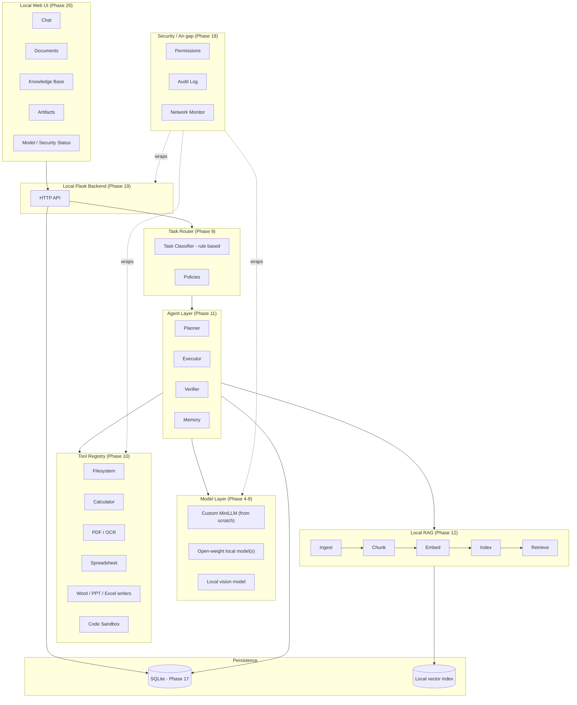
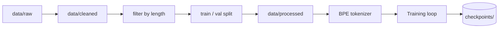
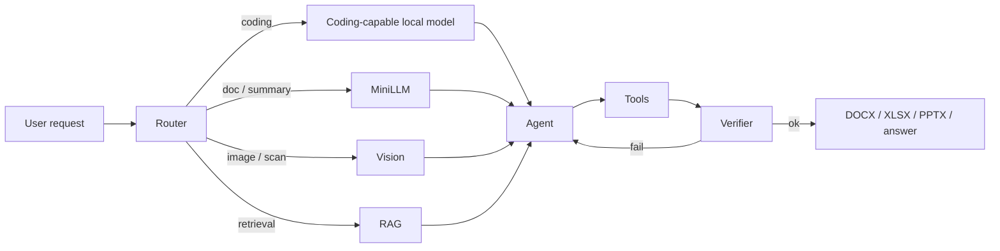
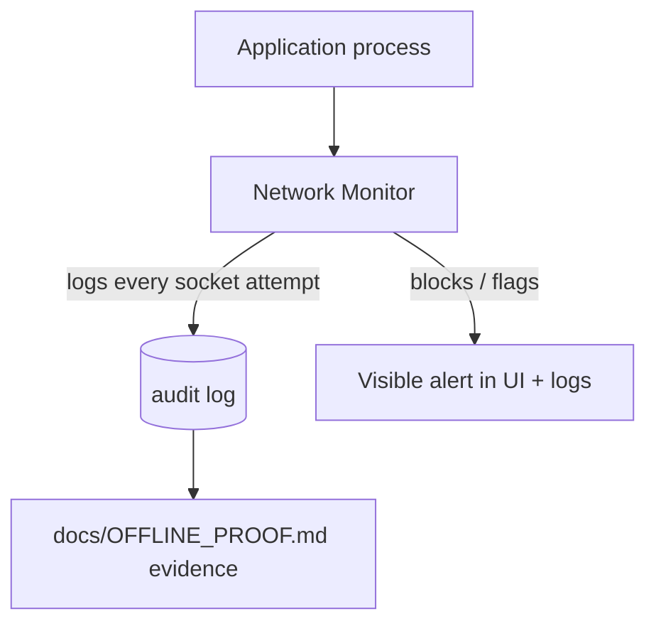

# SovereignAI — Architecture (Phase 0)

**Problem Statement:** SIH 117 — a self-hosted, air-gapped AI workbench
for refineries / PSUs / defence-linked manufacturing units.

**Author:** Akash Upadhyay (B.Tech CS/AI-ML)

**Status:** Living document, updated every phase. The authoritative
phase-by-phase status lives in `docs/BUILD_STATUS.md`.

---

## 1. One-paragraph summary

SovereignAI is a local application that lets an organization's staff
work with an AI assistant — chat, document analysis, coding, scanned-
document understanding, spreadsheet/word/slide generation — **without
any data ever leaving the machine it runs on**. It is built around a
from-scratch, self-trained educational language model, a pluggable
multi-model router, an agent loop with local tools, local retrieval-
augmented generation, local OCR/vision, and a Flask-based local web
UI — backed by SQLite and enforced by an explicit offline/security
layer.

---

## 2. Honesty ledger (kept accurate every phase)

| Component | What it actually is |
|---|---|
| Custom MiniLLM (tokenizer, Transformer, training loop) | **Genuinely built from scratch** in this repo, using PyTorch only for tensors/autograd/CUDA — not a pretrained model. Small (target ~4M-20M parameters). Educational/research grade, explicitly **not** a frontier model. |
| Additional local models (Phase 8+) | Open-weight models run locally through an adapter interface. Never a cloud API. |
| Task router (Phase 9) | **Rule-based** unless/until a learned classifier is explicitly built and labelled as such. |
| OCR (Phase 13) | Local text extraction from scans — **not** "vision understanding" unless a vision model is separately documented. |
| Vision (Phase 14) | Local vision model inference, scoped to exactly what it demonstrably does. |
| Sandboxed execution (Phase 15) | Isolated local subprocess execution with restrictions — not a hardened production-grade VM/container sandbox. |
| "Air-gapped" claim | Backed by a network monitor (Phase 18) producing **visible evidence** of zero outbound calls — not just an assertion. |

This table is expanded into `docs/FINAL_AUDIT.md` (Phase 24) once every
phase is complete.

---

## 3. System component diagram

## 4. Data flow (training-time)

## 5. Inference / agent flow (runtime)

## 6. Security / air-gap flow

---

## 7. Folder structure

Two intentional additions beyond the originally sketched structure,
both justified:

| Addition | Reason |
|---|---|
| `core/` | Shared config + logging + corpus-reading utilities used by every phase. Avoids duplicating path/logging logic across 24 phases. |
| `tokenizer/tests/` | Standalone tokenizer test suite, as required. |

Directories for phases not yet built (`training/`, `router/`,
`agents/`, `tools/`, `rag/`, `database/`, `security/`, `app/`,
`models/custom_minilm/`, `models/adapters/`, `models/vision/`) exist
as **empty, reserved folders** with only a short `README.md` — no
placeholder code, no `pass` stubs. They are populated only when their
phase is reached.

## 8. Dependency plan

| Package | Used for | Phase | Runtime/dev | Internet at runtime? |
|---|---|---|---|---|
| torch | tensors, autograd, CUDA | 1+ | runtime | No |
| numpy | numeric utilities | 1+ | runtime | No |
| pytest | test running | 1+ | dev | No |
| flask *(later)* | local backend (not FastAPI) | 19 | runtime | No |
| python-docx *(later)* | Word generation | 16 | runtime | No |
| python-pptx *(later)* | PowerPoint generation | 16 | runtime | No |
| openpyxl *(later)* | Excel generation | 16 | runtime | No |
| pymupdf *(later)* | PDF parsing/rendering | 13 | runtime | No |
| pytesseract *(later)* | OCR (needs local Tesseract binary) | 13 | runtime | No (after install) |
| faiss-cpu *(later)* | local vector index | 12 | runtime | No |

Every license/purpose is re-confirmed in `docs/FINAL_AUDIT.md` once
its phase is reached.

## 9. Model strategy

1. **Phases 3-7** — build one tiny (~4-20M parameter) decoder-only
   Transformer completely from scratch (own tokenizer, own attention,
   own RMSNorm, own RoPE, own SwiGLU, own training loop), sized for a
   6 GB VRAM RTX 4050 laptop.
2. **Phase 8** — wrap it behind a `ModelProvider` interface so it is
   just *one* of potentially several registered models.
3. **Phase 8+ (optional, hardware-permitting)** — register one
   additional open-weight local model purely through the adapter
   interface, with no changes to earlier phases. License / VRAM /
   offline-compatibility verified before adding it.

## 10. Data strategy

- Only synthetic (self-authored) or clearly-licensed public data.
- Every raw file gets a metadata JSON: `source`, `license`,
  `processing_notes`, `sha256`.
- Raw → cleaned → processed → tokenized, each stage on disk and
  inspectable.
- A tiny synthetic corpus proves the **pipeline** works — it is not
  evidence of model fluency.

## 11. 24-phase roadmap

| # | Phase | One-line goal |
|---|---|---|
| 0 | Architecture | This document |
| 1 | Foundation | Repo skeleton, config, logging, GPU check |
| 2 | Data | raw→cleaned→processed pipeline + synthetic corpus |
| 3 | Tokenizer | From-scratch byte-level BPE + tests |
| 4 | NN foundations | Embeddings, RMSNorm, RoPE, attention math (unit tested) |
| 5 | Transformer/MiniLLM | Assemble the full model |
| 6 | Training | Real autoregressive training loop |
| 7 | Checkpoint/Inference | Save/load/resume + generation |
| 8 | Multi-model abstraction | ModelProvider / adapters |
| 9 | Router | Rule-based task → model/tool routing |
| 10 | Tools | Filesystem, calculator, PDF, sandbox, etc. |
| 11 | Agent | Planner/executor/verifier/memory loop |
| 12 | RAG | Local ingestion/embedding/retrieval |
| 13 | OCR | Scanned-PDF text extraction |
| 14 | Vision | Local image understanding |
| 15 | Sandboxed coding | Isolated code execution + verification |
| 16 | Document outputs | DOCX/XLSX/PPTX generation |
| 17 | SQLite | Application persistence |
| 18 | Security | Offline enforcement, audit, permissions |
| 19 | Backend | Flask app tying subsystems together |
| 20 | UI | Local web workbench |
| 21 | End-to-end | Full integration |
| 22 | Evaluation | Benchmarks/eval scripts |
| 23 | SIH demo | Demos A-E |
| 24 | Docs/audit | Final documentation + `FINAL_AUDIT.md` |

Live status of each row: `docs/BUILD_STATUS.md`.

## 12. SIH demo scenarios (built in Phase 23)

- **Demo A** — Scanned inspection report → OCR → findings → agent plan → DOCX approval note.
- **Demo B** — Coding request → router → coding model → sandbox → verified code.
- **Demo C** — Local knowledge question → RAG retrieval + citations → answer.
- **Demo D** — Multimodal document → vision/OCR → analysis → deliverable.
- **Demo E** — Sovereignty proof → network monitor shows zero external calls.

## 13. Risks & limitations (kept honest)

- A 4-20M parameter model will **not** produce fluent, general-purpose
  text — it is a learning vehicle for how LLMs actually work, not a
  chat product. The workbench's practical usefulness comes from
  routing real tasks to a stronger open-weight local model, while the
  from-scratch model demonstrates genuine understanding of the
  internals (the thing judges will actually ask about).
- 6 GB VRAM limits batch size / context length; staged experiments
  (10-50 steps → 100-500 steps → longer run) exist specifically to
  make this constraint visible rather than hidden.
- OCR/vision quality depends entirely on whichever local model is
  chosen in Phase 13/14 — will be scoped honestly, not oversold.
- The code sandbox (Phase 15) reduces risk but is not a substitute for
  a hardened, audited container runtime; called out explicitly
  wherever the sandbox is documented.

## 14. Definition of "done" (whole project)

1. All 24 phases have an entry in `docs/BUILD_STATUS.md` marked
   COMPLETE with a passing test command.
2. Demos A-E (§12) run end-to-end on the Windows 11 / RTX 4050
   development machine.
3. `docs/FINAL_AUDIT.md` accurately answers every question in its
   template (custom vs open-weight vs rule-based, data provenance,
   licenses, what never leaves the machine, limitations).
4. No component silently depends on internet access at runtime.
